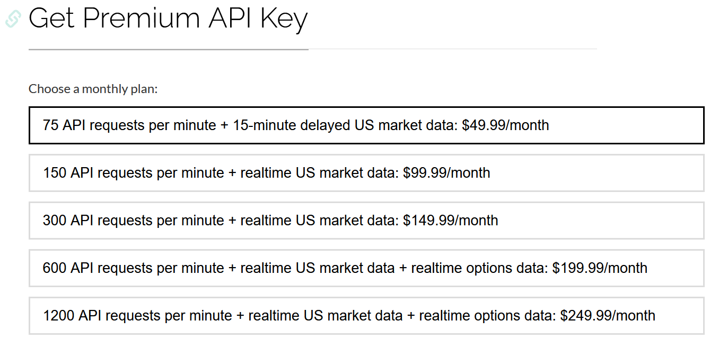
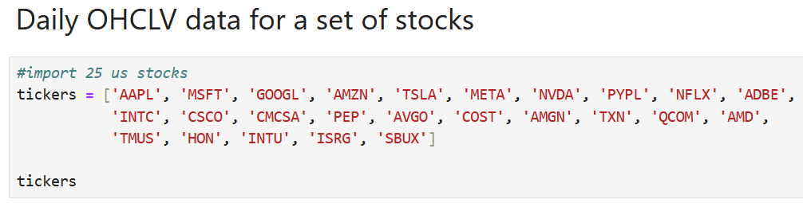
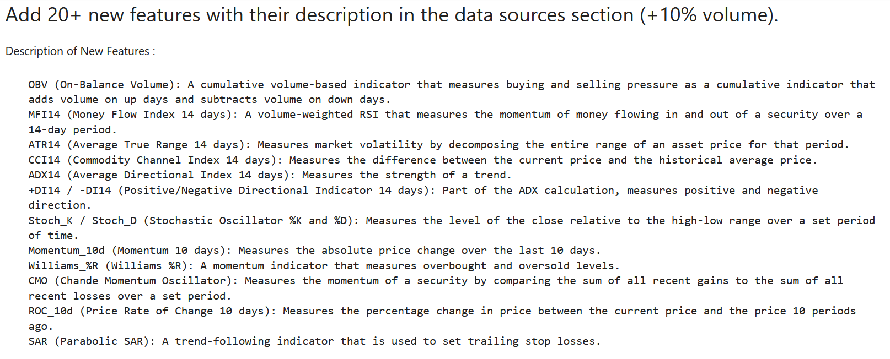
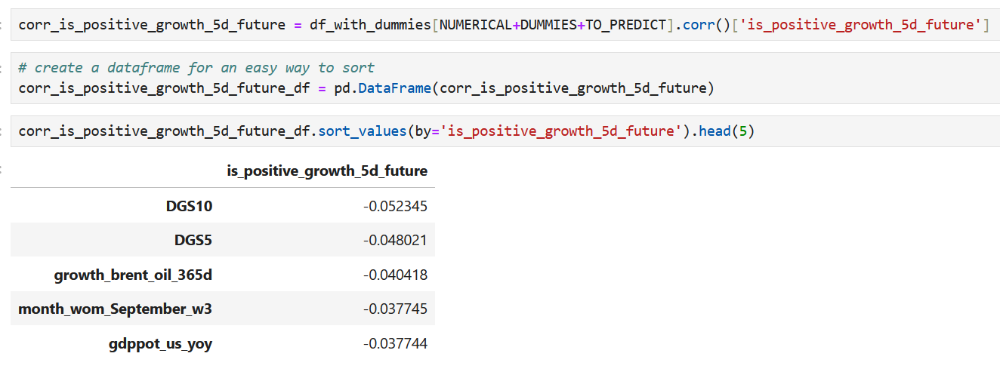
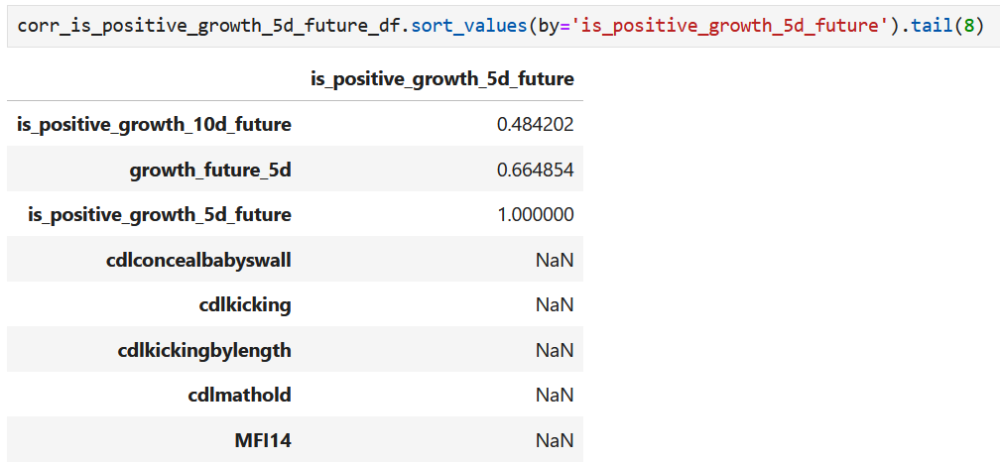

# stock-market-project
=======
# Problem Description
- Problem : I want use the stock from alpha vantage but only free 25 ticker/day and paid quite expensive
 
- Solution : so i use choose yfinance api with many features.
- Problem : Can't install TA-lib from windows using pip install TA-lib.
- Solution : install manually using visual code c++ and add into pip library
Download ta-lib-0.4.0-msvc.zip and unzip to C:\ta-lib.

    This is a 32-bit binary release. If you want to use 64-bit Python, you will need to build a 64-bit version of the library. Some unofficial instructions for building on 64-bit Windows 10 or Windows 11, here for reference:

        Download and Unzip ta-lib-0.4.0-msvc.zip
        Move the Unzipped Folder ta-lib to C:\
        Download and Install Visual Studio Community (2015 or later)
            Remember to Select [Visual C++] Feature
        Build TA-Lib Library
            From Windows Start Menu, Start [VS2015 x64 Native Tools Command Prompt]
            Move to C:\ta-lib\c\make\cdr\win32\msvc
            Build the Library nmake

            or from https://medium.com/pythons-gurus/how-to-properly-install-ta-lib-on-windows-11-for-python-a-step-by-step-guide-13ebb684f4a6
- Problem : 
  Short-term trading:
  Pros: Potentially higher returns, More active involvement
  Cons: Higher risk, Time commitment, higher tax rates
  Long-term trading:
  Pros: Lower risk, less time commitment, lower tax rates.
  Cons: Might be slower returns, less active involvement
- Solution:
  Short-term trading can be lucrative but is riskier and requires a significant time commitment. It's best suited for experienced investors with a high tolerance for risk.
  Long-term trading is a more relaxed approach that benefits from market growth over time. It's a good option for most investors, especially beginners (needs more training with model for long term example data 30,60,90,180,360 days).
 
# Define Objectives and Scope
## Objective: Develop a short-term trading strategy focusing on growth for several days/5 days for 25 US stocks.
## Scope:
    Instruments: 25 US stocks from various sectors.
    Investment Horizon: Short-term (holding periods of one week).

# Data Sources 
## Objective: Gather historical OHLCV (Open, High, Low, Close, Volume) data for the selected stocks.
## Procedure:
    Use the yfinance API to download historical data and add several features.
    Store data in a structured format for further analysis.
    For the details see Data Source With New Features.ipynb file.



# Data Preprocessing
## Objective: Clean and enhance data with technical indicators for strategy development.
## Procedure:
    Handle missing values and normalize data if necessary.
    Adding features such as: 
    - Momentum indicators
    - Volume, Volatility, Cycle, Price indicators
    - Pattern indicators
    Calculate Tech Indicators and Merge to the original dataframe

# Data Transformations
## Objective: Clean and enhance data with technical indicators for strategy development.
## Procedure:
- Data is combined into one data frame. Feature sets are defined (TO_PREDICT, NUMERIC, DUMMIES)

- New relevant features are generated from transformations (at least 5. One dummy set is one feature): it can be binned variables from numeric features or manual transformations.
Create a new string column weekday and month columns
Create a new string column 'month_wom' (month_week_of_month)
Binned variables from numeric features
Interaction features
Lag features

# Explorartory Data Analysis (EDA)
## Objective: Clean and enhance data with technical indicators for strategy development.
## Procedure:
Correlation between df_dummies correlation with is_positive_growth_5d_future
corr_is_positive_growth_5d_future = df_with_dummies[NUMERICAL+DUMMIES+TO_PREDICT].corr()['is_positive_growth_5d_future']
Correlation between df_dummies correlation with growth future 5d
corr_growth_future_5d = df_with_dummies[NUMERICAL+DUMMIES+TO_PREDICT].corr()['growth_future_5d']


For the details see Data Transformations, EDA, Modeling, Trading Simulation.ipynb

# Modeling
I used DecisionTree algorithm, RandomForest algorithm, logistic regression algorithm and hyperparameter tuning for each algorithm. Then, custom decision rules on target higher probability events.
Also, i used deep neural networks and hyperparameter tuning in the end.

# Trading Simulation
- Vector simulations for at least 1 strategy (and approximate returns on capital).
- Two or more strategies are covered (sim1_, sim2_, etc. fields are generated for each prediction).
- Exact simulations (iter.rows) with reinvestment of capital gains and efficient capital utilization.
- Profitability discussion vs. benchmark, CAGR, Sharpe ratio, max drawdown, rolling returns, etc.
- The best strategy has advanced features: risk management (e.g., stop loss), time of entry/sell, increased investment with higher probability, portfolio optimization.
- New strategy: introduce a new empirical strategy based on the predictions, e.g., long-short strategy, or use no more than 1-3-5 concurrent investments, or combine with market conditions (trade only when volatility is high or current price is close to 52 weeks low), etc.
- Exceptional profitability: choose a realistic benchmark (e.g., S&P500 index) and show that your best prediction/strategy delivers better performance (CAGR) on average than a benchmark.
- Deep exploratory analysis: how predictions/precision are different by tickers (or markets, or month of year, or other features, etc.). Debug wrong predictions. Give ideas on the data features/models/strategies improvement based on the insights.

# Deployment and Automation Module

    Create a Pipfile with all dependencies.
    Install the dependencies using Pipenv.
    Generate requirements.txt from the Pipenv environment.

Step 1: Create a Pipfile

Create a Pipfile in your project directory with the following content:
[[source]]
name = "pypi"
url = "https://pypi.org/simple"
verify_ssl = true

[dev-packages]

[packages]
pandas = "*"
numpy = "*"
scikit-learn = "*"
joblib = "*"
tqdm = "*"
talib = "*"
yfinance = "*"
pandas-datareader = "*"

Step 2: Install the Dependencies

Run the following command to install the dependencies:
pipenv install

tep 3: Generate requirements.txt

After installing the dependencies, you can generate a requirements.txt file:
pipenv lock -r > requirements.txt

# Algo Trading

This project implements an end-to-end algorithmic trading strategy using the `yfinance` API.

## Installation

1. Clone the repository.
2. Navigate to the project directory.
3. Create a virtual environment and install dependencies:

```sh
python -m venv env
source env/bin/activate   # On Windows use `env\Scripts\activate`
pip install -r requirements.txt

# Local Automation Instructions

## Setting Up the Project Environment (in Terminal)

* Change the working directory to the Module5 folder: `cd 05-deployment-and-automation/`
* Install virtual environment: `pip3 install virtualenv`
* Create a new virtual environment (venv): `virtualenv venv` (or run `python3 -m venv venv`)
* Activate the new virtual environment: `source venv/bin/activate`

* Install all requirements to the new environment (venv): `pip3 install -r requirements.txt`

## Running the Project

* Start the local Jupyter Server (after activating venv): `jupyter notebook` (you can check all servers running with `jupyter notebook list`)
* Open `test.ipynb` to check the system's operation:
  * From your web browser (navigate to http://localhost:8888/tree or similar)
  * Or via the VS Code UI (specify the server address kernel) 
* Run `main.py` from the Terminal (or Cron) to simulate one new day of data.
>>>>>>> 3ce90e5 (first commit project)
