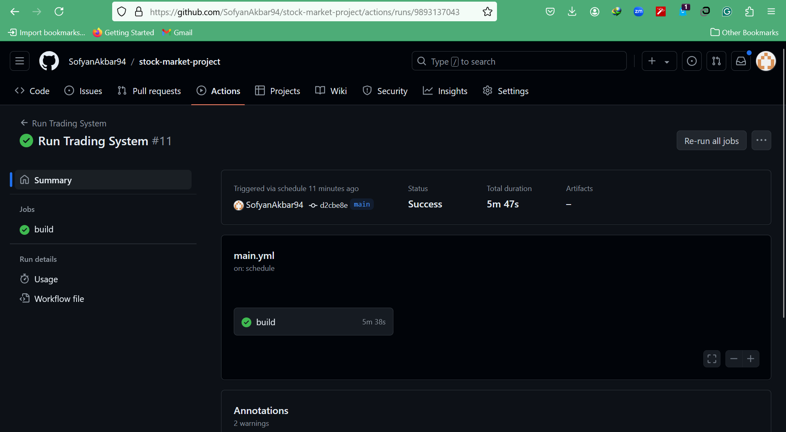
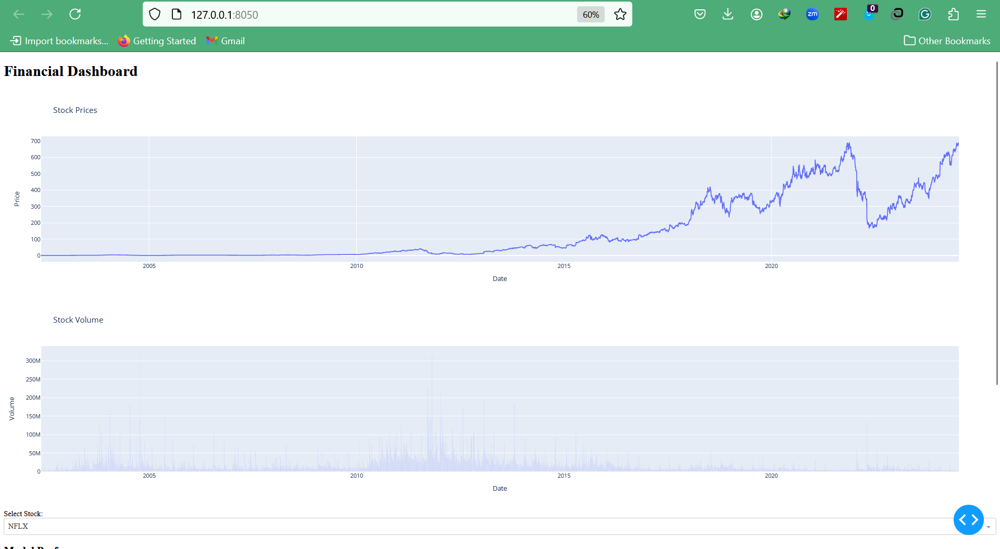

# stock-market-project
=======
## Problem Description
- Problem : I want use the stock from alpha vantage but only free 25 ticker/day and paid quite expensive
 
- Solution : so i use choose yfinance api with many features.
- Problem : Can't install TA-lib from windows using pip install TA-lib.
- Solution : install manually using visual code c++ and add into pip library
Download ta-lib-0.4.0-msvc.zip and unzip to C:\ta-lib.

    This is a 32-bit binary release. If you want to use 64-bit Python, you will need to build a 64-bit version of the library. Some unofficial instructions for building on 64-bit Windows 10 or Windows 11, here for reference:

        Download and Unzip ta-lib-0.4.0-msvc.zip
        Move the Unzipped Folder ta-lib to C:\
        Download and Install Visual Studio Community (2015 or later)
            Remember to Select [Visual C++] Feature
        Build TA-Lib Library
            From Windows Start Menu, Start [VS2015 x64 Native Tools Command Prompt]
            Move to C:\ta-lib\c\make\cdr\win32\msvc
            Build the Library nmake

            or from https://medium.com/pythons-gurus/how-to-properly-install-ta-lib-on-windows-11-for-python-a-step-by-step-guide-13ebb684f4a6
- Problem : 
  1. Short-term trading:
  Pros: Potentially higher returns, More active involvement.
  Cons: Higher risk, Time commitment, higher tax rates.
  2. Long-term trading:
  Pros: Lower risk, less time commitment, lower tax rates.
  Cons: Might be slower returns, less active involvement.
- Solution:
  1. Short-term trading can be lucrative but is riskier and requires a significant time commitment. It's best suited for experienced investors with a high tolerance for risk.
  2. Long-term trading is a more relaxed approach that benefits from market growth over time. It's a good option for most investors, especially beginners (needs more training with model for long term example data 30,60,90,180,360 days).
 
## Define Objectives and Scope
### Objective: Develop a short-term trading strategy focusing on growth for several days/5 days for 25 US stocks.
### Scope:
- Instruments: 25 US stocks from various sectors.
- Investment Horizon: Short-term (holding periods of one week).

## Data Sources 
### Objective: Gather historical OHLCV (Open, High, Low, Close, Volume) data for the selected stocks.
### Procedure:
- Use the yfinance API to download historical data and add several features.
- Store data in a structured format for further analysis.
- For the details see Data Source With New Features.ipynb file.
- For the details please check Data Source With New Features.ipynb


## Data Preprocessing
### Objective: Clean and enhance data with technical indicators for strategy development.
### Procedure:
- Handle missing values and normalize data if necessary.
- Adding features such as: 
  - Momentum indicators
  - Volume, Volatility, Cycle, Price indicators
  - Pattern indicators
- Feature sets are defined (TO_PREDICT, NUMERIC, DUMMIES)
- Calculate Tech Indicators and Merge to the original dataframe
- For the details please check Data Source With New Features.ipynb & Data Transformations, EDA, Modeling, Trading Simulation.ipynb

## Exploratory Data Analysis (EDA)
### Objective: To understand the data characteristics, identify patterns, and discover insights that may guide further analysis and modeling decisions.
### Procedure:
- Univariate Analysis
- Bivariate Analysis
- Multivariate Analysis
- Correlation between df_dummies and is_positive_growth_5d_future

- Correlation between df_dummies and growth future 5d

- For the details see Data Transformations, EDA, Modeling, Trading Simulation.ipynb

## Modeling
### Objective: To build predictive models that can generalize well on unseen data, based on insights gained from EDA and data transformations.
### Procedure:
- Model Selection: Choose appropriate algorithms based on problem type (e.g., regression, classification) and data characteristics.
- Model Training: Fit the selected models to the training data while using techniques like cross-validation to optimize performance.
- Hyperparameter Tuning: Fine-tune model parameters to improve accuracy and generalization.
- Model Evaluation: Assess model performance using metrics such as accuracy, precision, recall, or RMSE (Root Mean Squared Error) depending on the problem.
- In this project used Decision Tree algorithm, Random Forest algorithm, logistic regression algorithm and hyperparameter tuning for each algorithm. Then, custom decision rules on target higher probability events. Also, i used deep neural networks and hyperparameter tuning in the end.
- Best model in this course is decision tree for the best precision is 0.5549 and the best depth is 19 and second best  is random forest for the best precision is 0.5538 and the best depth is 15. For the perfomance logistic regression and DNN is below decision tree and random forest.
- For the details see Data Transformations, EDA, Modeling, Trading Simulation.ipynb

## Trading Simulation
### Objective: To simulate trading strategies based on predictive models and evaluate their effectiveness in a controlled environment.
### Procedure:
- Strategy Definition: Define trading rules based on model predictions (e.g., buy/sell signals).
- Simulation Execution: Execute trades based on defined rules using historical or simulated data.
- Performance Evaluation: Measure the performance of the trading strategy using metrics like Sharpe ratio, profit/loss, and drawdown.
- Risk Management: Implement risk controls to manage exposure and minimize potential losses.
- In this course, I am conducting trading simulations using Vector simulations to explore at least one strategy. I am implement multiple strategies, denoted by fields like sim1_, sim2_, etc., for each prediction. The simulations will be executed with reinvestment of capital gains and efficient capital utilization using iter.rows. Discussions will cover profitability compared to benchmarks, CAGR, Sharpe ratio, max drawdown, rolling returns, and more. The most effective strategy will incorporate advanced features such as risk management (e.g., stop-loss), optimal timing for entry and exit, increased investment based on higher probability outcomes, and portfolio optimization.


- For the details see Data Transformations, EDA, Modeling, Trading Simulation.ipynb

## Deployment and Automation
### Objective: To deploy the predictive model and trading strategy into a production environment, automating data pipelines and decision-making processes.
### Procedure:
- Model Integration: Integrate the trained model into the production system, ensuring compatibility with real-time data sources.
- Pipeline Automation: Automate data ingestion, preprocessing, and model execution to handle new data seamlessly.
- Monitoring and Maintenance: Implement monitoring tools to track model performance and intervene if performance degrades.
- Feedback Loop: Continuously collect feedback from model outputs and trading results to refine and improve the system over time.

## Local Automation Instructions
## Setting Up the Project Environment (in Terminal) in Windows OS
  Using pipenv
* Change the working directory to the project folder: `cd project/`
* Install virtual environment: `pip install pipenv`
* Activate the new virtual environment (pipenv): `pipenv shell`

* Install all requirements to the new environment (pipenv): `pip install -r requirements.txt`
* The Pipfile file is intended to specify packages requirements for your Python application or library, both to development and execution. Build Pipfile: `pipenv install -r requirements.txt`
* Pipfile.lock is intended to specify, based on the packages present in Pipfile, which specific version of those should be used, avoiding the risks of automatically upgrading packages that depend upon each other and breaking your project dependency tree. You can lock your currently installed packages using: `pipenv lock`

  Using virtualenv
* Change the working directory to the Module5 folder: `cd project/`
* Install virtual environment: `pip install virtualenv`
* Create a new virtual environment (venv): `virtualenv venv`(or run `python -m venv venv`)
* Activate the new virtual environment: `source venv/bin/activate`
* Install all requirements to the new environment (pipenv): `pip install -r requirements.txt`

## Running the Project
* Start the local Jupyter Server (after activating venv or pipenv): `jupyter notebook` (you can check all servers running with `jupyter notebook list`)
* Open `test.ipynb` to check the system's operation:
  * From your web browser (navigate to http://localhost:8888/tree or similar)
  * Or via the VS Code UI (specify the server address kernel) 
* Run `main.py` from the Terminal (or Cron) to simulate one new day of data.

## Run cron job with github actions
* Create a Directory for GitHub Actions Workflows
    In your repository, create a directory named .github/workflows.
* Create a Workflow File
    Inside the .github/workflows directory, create a file named main.yml (or any descriptive name). This file will define the GitHub Actions workflow.
* Define Dependencies in requirements.txt
    Make sure all the required dependencies are listed in your requirements.txt file.
* Verify the Workflow
* Go to your GitHub repository.
    Click on the "Actions" tab.
    You should see your new workflow listed there. It will run based on the schedule you've set.


## Two regimes for the system
* Check two_regimes.py file to run the two_regimes

## Incremental data loading
* Check incremental_loading.py file to run the incremental_loading

## Step-by-Step Guide to Create and Deploy a Dashboard
1. Set Up the Environment
First, ensure you have the necessary packages installed. You can install them using pip:
`pip install dash plotly pandas joblib`
2. Create the Dashboard Application
Create a new file called dashboard.py 
3. Run the Dashboard Locally
You can run the dashboard locally by executing the following command in the terminal:
`python dashboard.py`
4. This will start a local server, and you can view the dashboard in your browser at http://127.0.0.1:8050/.
5. Deploy the Dashboard in aws

To make the dashboard live, you need to deploy it on a web server.


## Step-by-Step Guide to Containerizing
1. Create a requirements.txt file
This file should list all the Python packages your script depends on.
2. Update code dashboard.py
Ensure your dashboard.py script is set up to run the Dash app correctly and listen on all network interfaces by setting host='0.0.0.0' in the app.run_server method:
```
if __name__ == '__main__':
    app.run_server(host='0.0.0.0', port=8050, debug=True)
```
3. Create a Dockerfile
This file defines the Docker image.
4. Build the Docker Image
Open a terminal in the directory containing the Dockerfile and requirements.txt, then run the following command to build the Docker image:
`docker build -t dashboard-app .`
5. Run the Docker Container:
Once the image is built, you can run it using the following command:
`docker run -p 8050:8050 dashboard-app`
This maps port 8050 of the container to port 8050 on your host machine, allowing you to access the dashboard at http://localhost:8050.
6. Verify the Container:
Visit http://localhost:8050 in your web browser to verify that the dashboard is running correctly inside the container.

## Alternatives using Docker Compose
Here are the steps to create a docker-compose.yml file and use Docker Compose to run your dashboard-app:
Steps to Setup Docker Compose
1. Create docker-compose.yml File:
Create a docker-compose.yml file in the root directory of your project.
2. Add Service/Dockerfile Configuration:
Define the service/Dockerfile for your dashboard app and specify the port forwarding.
Steps to Use Docker Compose
3. Build and Start the Service:
`docker-compose up --build`
4. Access the Application:
Open your browser and navigate to http://localhost:8050.

## Steps to Deploy with AWS ECS and Fargate
1. Install AWS CLI and Configure Credentials:
Install the AWS CLI if you haven’t already.
Configure your AWS credentials.
`aws configure`
2. Create a Docker Image:
Ensure your Docker image is built and tagged appropriately.
`docker build -t dashboard-app .`
3. Push Docker Image to Amazon ECR:
* Create a repository in Amazon ECR.
* Authenticate Docker to your Amazon ECR registry.
* Tag your Docker image.
* Push the image to the ECR repository.
```
aws ecr create-repository --repository-name dashboard-app
$(aws ecr get-login --no-include-email --region your-region)
docker tag dashboard-app:latest your-aws-account-id.dkr.ecr.your-region.amazonaws.com/dashboard-app:latest
docker push your-aws-account-id.dkr.ecr.your-region.amazonaws.com/dashboard-app:latest
```
4. Create an ECS Cluster:
You can create a new cluster using the AWS Management Console or the AWS CLI.
`aws ecs create-cluster --cluster-name dashboard-cluster`
5. Create a Task Definition for Your Container:
Define a task for your ECS service, specifying the ECR image and the resources required.
Save ECS.json as task-definition.json and register it with ECS:
`aws ecs register-task-definition --cli-input-json file://task-definition.json`
6. Run the Task in Your Cluster:
Create a service to run your task in the ECS cluster.
    aws ecs create-service --cluster dashboard-cluster --service-name dashboard-service --task-definition dashboard-task --desired-count 1 --launch-type FARGATE --network-configuration "awsvpcConfiguration={subnets=[subnet-xxxxxxx],securityGroups=[sg-xxxxxxx],assignPublicIp=ENABLED}"
Ensure you replace subnet-xxxxxxx and sg-xxxxxxx with your actual subnet and security group IDs.
7. Access Your Application:
You can access your application via the public IP address assigned to the ECS service. You can find this in the ECS service details in the AWS Management Console.
Notes:
    Security Groups: Ensure the security group associated with the ECS task allows inbound traffic on port 8050.
    VPC and Subnets: Ensure the ECS service is launched in a VPC with subnets that have internet access (public subnets).

## Acknowledgement
I would like to extend our sincere appreciation to Ivan Brigida for his invaluable contributions to the field of machine learning, particularly in advancing our understanding of time series analysis. Ivan's insights have provided a significant impact, offering novel perspectives and innovative approaches that have enriched our methodologies and applications in predictive modeling and forecasting.

His dedication to exploring new avenues within time series analysis has not only broadened our theoretical understanding but has also enhanced practical applications across various domains, including finance, economics, and beyond. Ivan's expertise and passion for pushing the boundaries of machine learning have inspired and influenced our research profoundly.

I am grateful for Ivan Brigida's collaboration, expertise, and commitment to advancing the forefront of machine learning, and i look forward to continuing to build upon his foundational contributions in our ongoing work.